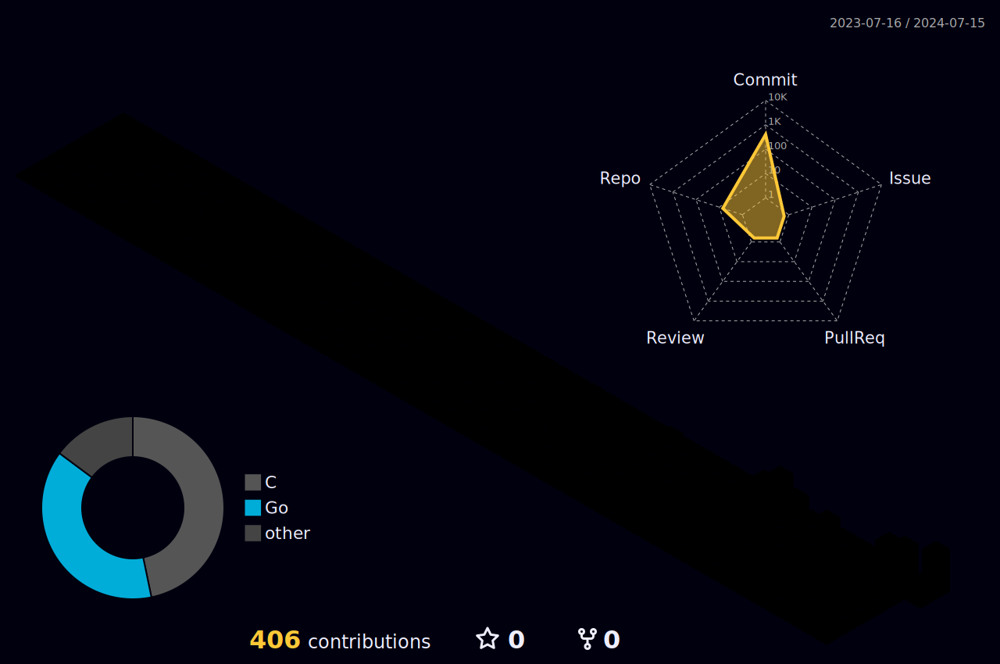

<!-- <h1 align="center">Hi there! 👋 I'm Shorei Takada</h1> -->

## About Me

- 🎓 On break from **Kwansei Gakuin University, School of Policy Studies**
- 📚 Currently learning at **42Tokyo** (Since April 2024)
- 🌏 Multilingual: **Japanese, Chinese, Korean**

📜 Certifications

| Certification | Date |
|---------------|------|
| Information Technology Passport Examination (IP) | June 2023 |
| Information Security Management Examination (SG) | August 2023 |
| Fundamental Information Technology Engineer Examination (FE) | October 2023 |

<!--
## 42Tokyo Progress

  
  

## Journey of Continuous Improvement 🚀

  <h4>Thanks for visiting my profile! 👋</h4>
  

<!--
## Languages and Tools  

  
  
  
  
  
  
  
  
  
  

  

   
-->
